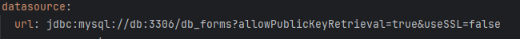
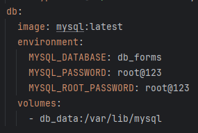
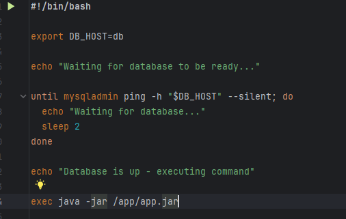

# test-docker-api-mysql
Repositório que hospeda testes que fiz com docker, spring e mysql

Comandos para subir localmente
1. Build
Nesta etapa, o Docker gera uma build utilizando o Maven, criando um arquivo .jar que pode ser utilizado para iniciar a aplicação. O comando para gerar a build é:

- docker build -t subscriber-api:1.0 .

Essa build usa o application.yml para se conectar ao banco de dados dentro do Docker. É importante garantir que o nome do serviço no docker-compose.yml seja o mesmo que está configurado no application.yml.

Dica: No application.yml, ao invés de usar 'localhost' ou um IP específico para se conectar ao banco, utilizamos o nome do serviço (db), já que ambos (API e banco de dados) estão rodando em containers no mesmo ambiente Docker.

# RUN
Após gerar a build, o próximo passo é subir o banco MySQL. Um volume é criado automaticamente ao inicializar o serviço do banco pela primeira vez, para armazenar os dados de forma persistente. Esse volume estará sempre disponível, a menos que você execute o comando docker-compose down -v, que remove os volumes criados.

Para subir os serviços, use o comando:

- docker-compose up -d

Este comando inicializa os serviços definidos no docker-compose.yml. Para garantir que a API só inicie após o banco de dados estar disponível, incluí um script de espera, que fica monitorando a porta do banco de dados. Esse mecanismo evita erros de conexão entre a API e o banco de dados.

Observações
Certifique-se de que o Docker e o Docker Compose estão instalados e funcionando corretamente no seu sistema.
A aplicação utiliza o volume do Docker para persistir os dados do banco MySQL. Portanto, os dados serão mantidos entre as reinicializações, a menos que o comando docker-compose down -v seja executado.

